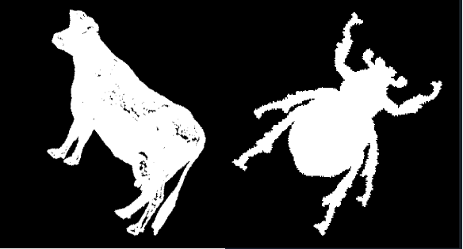
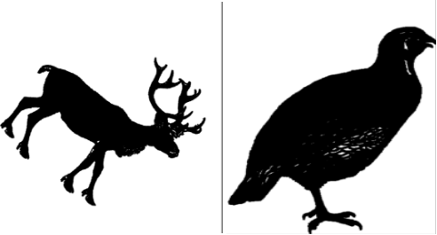

# Image Processing using Queue and Stack

## Overview
This project involves creating an image manipulation tool in C++ using **PGM (Portable GrayMap)** image files. The project covers reading, writing, and performing various operations on binary images. The key tasks include calculating image statistics, converting images to negative, and extracting connected components using queue and stack data structures. The original assignment required working with `.pgm` files and manipulating image data based on pixel values (0 for black and 255 for white).

## Requirements
- **Software**: Install [Filestar](https://filestar.com/skills/gif/convert-gif-to-pgm) for converting `.gif` files to `.pgm`.
- **C++ Compiler**: Any standard C++ compiler (e.g., GCC, Clang, etc.).

## Features
1. **Image Class**: This class is responsible for handling PGM images with the following operations:
   - `Read`: Reads the PGM file and stores the image as a 2D array of pixel values.
   - `Save`: Saves the 2D image into a `.pgm` file format.
   - `GetPixel`: Returns the pixel value at a given row and column, handling out-of-bound errors.
   - `SetPixel`: Updates the pixel value at a given position, also handling out-of-bound errors.
   - `GetSize`: Returns the size of the image (width and height).
   - `ConvertToNegative`: Converts the image to its negative (inverting 0 to 255 and vice versa).

2. **Statistics Calculation**:
   - **Mean Pixel Value**: Computes the mean of all pixel values.
   - **Black & White Pixel Count**: Counts the number of black (0) and white (255) pixels.
   - **Average Black Pixels per Row**: Calculates the average number of black pixels in each row.

3. **Image Negation**:
   - Converts the image to its negative and saves the result as a `.pgm` file.

4. **Connected Component Extraction**:
   - Extracts connected components of pixels based on user-provided coordinates.
   - Implemented using both queue and stack data structures for demonstration.
   - Saves the extracted component as a new image, appending a timestamp to avoid overwriting.

## Instructions

### Image Manipulation
In this question, the program:
- Reads a PGM image.
- Calculates and displays the mean pixel value, number of black and white pixels, and the average number of black pixels per row.
- Converts the image to its negative and saves it.

**Example of original and negative images**:

Original Images:
 

Negative Images:
 

### Connected Component Extraction (Queue) & Stack
- This question extracts connected components starting from a user-specified pixel.
- Uses the **Queue** data structure to process the connected pixels.
- The output is saved as a binary image with all connected pixels displayed in black.
- Similar to Question 2, but this time uses a **Stack** instead of a Queue to extract the connected component.
- Saves the extracted region as a new binary image.

**Original and Extracted Components**:

Original Images:
 

Extracted Component:
 

Original Images:
 

Extracted Component:
 

### Menu
The program presents the user with the following options:
1. Press 1 to run the solution for **Question 1** (Image Statistics and Negation).
2. Press 2 to run the solution for **Question 2** (Connected Component using Queue).
3. Press 3 to run the solution for **Question 3** (Connected Component using Stack).

### Error Handling and Logging
- The program handles incorrect input gracefully and prevents crashes by validating user input.
- A log file is generated at the end of each run, summarizing the operations performed. The log file is named with a timestamp (e.g., `log_202210292200.txt`), where the number represents the date and time (YYYYMMDDHHMM format).

## Conclusion
This project provided valuable insights into image processing, working with PGM files, and using data structures like queues and stacks. A key learning experience was correctly handling the row and column structure of the image files, which caused initial issues in component extraction.

